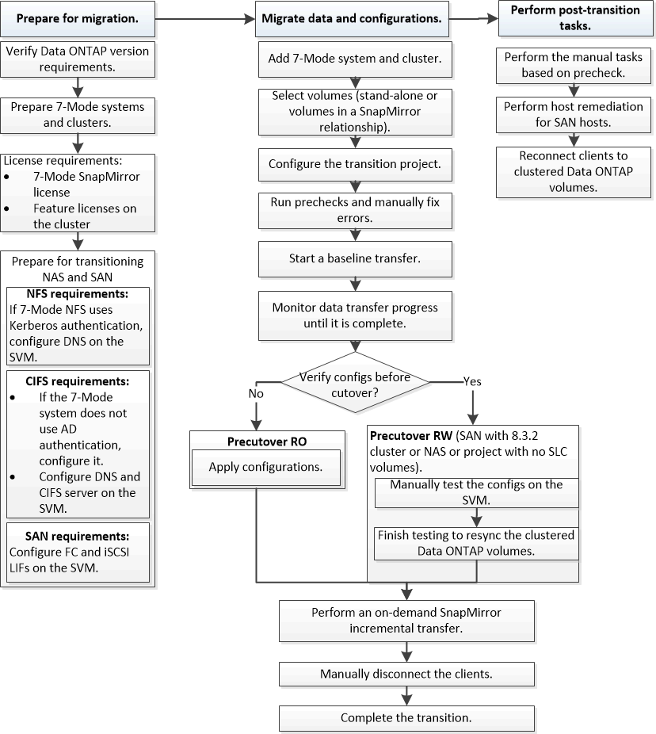

= Copy-Based Transition Workflow
:allow-uri-read: 
:icons: font
:imagesdir: ../media/

[role="lead"]
Der Copy-basierte Transition Workflow umfasst die Vorbereitung auf die Migration, die Migration von Daten und Konfigurationen sowie die Durchführung von Konfigurationen nach dem Umstieg.

