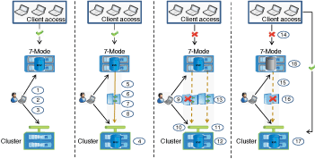

= Wie Sie ein eigenständiges Volumen umstellen
:allow-uri-read: 
:icons: font
:imagesdir: ../media/

[role="lead"]
Die Umstellung auf ein eigenständiges Volume umfasst verschiedene Phasen: Vorbereitung, Datenkopie, Anwenden der Konfiguration (Vorumstellung) und Storage-Umstellung. Nach Abschluss der Umstellung müssen Sie einige Schritte nach dem Umstieg durchführen, bevor Sie den Client-Zugriff wieder aufnehmen. Um Ihren Wechsel effizient managen zu können, sollten Sie diese Phasen kennen.

|===
| Signifikant | Schritte 

 a| 
Vorbereitung
 a| 
. Erfassung von Informationen
. Durchführen der Vorprüfung
. Erstellen von Zeitplänen für Datenkopieerstellung

 a| 
Datenkopieerstellung
 a| 
. Erstellen der ONTAP Volumes als schreibgeschützt
. Aufbau einer Peer-Beziehung für den Wechsel
. SnapMirror Beziehung aufbauen
. Durchführen eines Basistransfers
. Die geplanten inkrementellen Updates werden durchgeführt

 a| 
Vorumstellung
 a| 
. Die SnapMirror Beziehung zu unterbrechen
. Anwenden von Konfigurationen auf die SVM
. Konfigurieren von Daten-LIFs auf der SVM
. Testen von Daten und Konfigurationen (manuell und nur für Prekuover RW)
. ONTAP Volumes werden mit den entsprechenden 7-Mode Volumes neu synchronisiert

 a| 
Storage-Umstellung
 a| 
. Trennen des Client-Zugriffs (manuell)
. Durchführen eines letzten SnapMirror Updates
. Die SnapMirror Beziehung zu unterbrechen
. Entfernen von 7-Mode IP-Adressen und Einstellen der Daten-LIFs auf den up-Status der SVM
. Versetzen des Quell-Volume in den Offline-Modus

Nach der Umstellung Schritte nach der Transition durchführen und Client-Zugriff aktivieren (manuell)

 a| 
Kontrollkette für SnapLock Volumes
 a| 
. Enumeration aller WORM-Dateien aus 7-Mode-Volumes
. Berechnung des Fingerabdrucks für jede WORM-Datei auf den 7-Mode-Volumes (im vorherigen Schritt aufgeführt) und Berechnung des Fingerabdrucks für die entsprechende WORM-Datei auf den ONTAP-Volumes umgestiegen
. Erstellen eines Berichts mit Details über die Anzahl der Dateien mit übereinstimmenden und nicht übereinstimmenden Fingerabdrücken und den Grund für die Diskrepanz

|===

== Vorbereitungsphase

In dieser Phase werden Informationen zum 7-Mode System und zu den Cluster, Volumes und IP-Adressen erfasst. Das 7-Mode Transition Tool führt in dieser Phase folgende Aufgaben durch:

. Erfasst und fügt 7-Mode Storage-System- und Volume-Informationen hinzu
. Führt den Vorcheck für den Übergang aus.
. Erfassen und Hinzufügen von Informationen zu Clustern, SVMs und Aggregaten
. Erfasst IP-Adressen, die auf der SVM konfiguriert werden müssen:
+
** Wählt die IP-Adressen aus, die im 7-Mode System vorhanden sind.
** Gibt neue IP-Adressen an, die auf der SVM konfiguriert werden müssen. HINWEIS: Die Umstellung von iSCSI und FC LIFs (SAN) wird vom Tool nicht unterstützt. Vor der Transition müssen Sie die SAN-LIFs auf der SVM manuell konfigurieren.

. Erstellt Zeitpläne für Datenkopieerstellung für Basiskopie und inkrementelle Updates.
. Wenn das Projekt SnapLock-Volumes enthält, sammelt Informationen über die Lese-/Schreib-SnapLock-Volumes, für die eine Verifikation der Kontrollkette erforderlich ist, und die Details des ONTAP-Volumes, in dem die Fingerabdruckdaten gespeichert werden, die während des Verifizierungsvorgangs für die Kette der Kustodie generiert werden.
+

NOTE: Die Verifizierungsfunktion „Chain of Custody“ wird nur für Volumes mit Dateinamen unterstützt, die nur ASCII-Zeichen enthalten.

. Planung der Konfigurationsübergang durch Auswahl der 7-Mode Konfigurationen, die auf die Ziel-SVM und Ziel-Volumes übertragen werden müssen

Sie sollten die Objekte (Volumes, IP-Adressen, Systeminformationen usw.) auf dem Controller nicht ändern, nachdem Sie die während der Vorprüfung gemeldeten Fehler und Warnungen behoben haben.

== Phase der Datenkopieerstellung

In dieser Phase werden die Daten aus den 7-Mode Volumes in die ONTAP Volumes kopiert. Das 7-Mode Transition Tool führt in dieser Phase folgende Aufgaben durch:

. Erstellt die ONTAP Volumes mit schreibgeschütztem Zugriff.
. Einrichten einer Peer-Beziehung zwischen dem 7-Mode System und der SVM
. Einrichtung einer SnapMirror Umstiegsbeziehung (Beziehung vom Typ TDP) zwischen den 7-Mode Volumes und ONTAP Volumes
. Abschluss des Transfers der Basiskopie der Daten anhand von Zeitplaneinträgen
. Führt geplante, inkrementelle Updates für die ONTAP Volumes durch

== Anwenden der Konfigurationsphase (Vorumstellungsphase)

Als Best Practice wird empfohlen, vor dem geplanten Umstellungsfenster einige Tage oder Wochen einen Vorumstellvorgang durchzuführen. Mit dieser Aktivität wird überprüft, ob alle Konfigurationen ordnungsgemäß angewendet werden und ob Änderungen erforderlich sind.

In dieser Phase werden Konfigurationen aus den 7-Mode Volumes in die ONTAP Volumes kopiert.

Es gibt zwei Modi für die Phase Apply Configuration (precutover): *Precutover read-only* und *precutover read/write*.

Der Vorüberlesen-/Schreibmodus wird nicht unterstützt, wenn das Projekt Folgendes enthält:

* SAN Volumes und der Ziel-Cluster führen Data ONTAP 8.3.1 oder eine frühere Version aus
+
In diesem Fall werden in der Phase Apply Configuration (Vorumover) die folgenden Konfigurationen nicht angewendet. Stattdessen werden sie in der Umstellungsphase angewendet.

+
** SAN-Konfigurationen
** Snapshot Zeitplan-Konfigurationen

* SnapLock Compliance Volumes
+
Wenn das Projekt SnapLock-Compliance-Volumes enthält, werden die Snapshot-Planungskonfigurationen in der Vorumstellungsphase nicht angewendet. Stattdessen werden diese Konfigurationen während der Umstellungsphase angewendet.

+
xref:concept_considerations_for_transitioning_of_snaplock_compliance_volumes.adoc[Überlegungen für den Wechsel zu SnapLock Compliance Volumes]

Wenn auf dem Zielcluster Data ONTAP 8.3.1 oder früher ausgeführt wird und Sie die Anwendung-Konfiguration (Vorumschaltung) im Lese-/Schreibmodus für NAS-Volumes ausführen möchten, müssen Sie separate Projekte für die NAS-Volumes und SAN-Volumes erstellen. Diese Aktion ist erforderlich, da der Lese-/Schreibmodus für die Vorumschaltung nicht unterstützt wird, wenn Sie SAN-Volumes in Ihrem Projekt haben.

Wenn das Projekt SnapLock-Compliance-Volumes enthält und Sie die Anwendung der Konfiguration (Vorumschaltung) im Lese-/Schreibmodus für nicht-SnapLock-Compliance-Volumes ausführen möchten, müssen Sie separate Projekte für SnapLock-Compliance-Volumes und nicht-SnapLock-Compliance-Volumes erstellen. Diese Aktion ist erforderlich, da der Lese-/Schreibmodus für die Vorumschaltung nicht unterstützt wird, wenn Sie SnapLock-Compliance-Volumes in Ihrem Projekt haben.

Das Tool führt die folgenden Schritte im Modus *Vorumlesen schreibgeschützt* aus:

. Inkrementelle Aktualisierung von 7-Mode Volumes auf ONTAP Volumes
. Bricht die SnapMirror Beziehung zwischen 7-Mode Volumes und ONTAP Volumes auf.
+

NOTE: Bei SnapLock Compliance Volumes ist die SnapMirror Beziehung zwischen dem 7-Mode Volume und den ONTAP Volumes nicht beschädigt. Die SnapMirror Beziehung ist nicht gebrochen, da die SnapMirror Neusynchronisierung zwischen 7-Mode und ONTAP Volumes für SnapLock Compliance Volumes nicht unterstützt wird.

. Erfasst Konfigurationen von 7-Mode Volumes und wendet diese Konfigurationen auf die ONTAP Volumes und die SVM an.
. Konfiguration der Daten-LIFs auf der SVM:
+
** Vorhandene 7-Mode IP-Adressen werden auf der SVM im administrativen Ausfall erstellt.
** Neue IP-Adressen werden auf der SVM im administrativen up-Status erstellt.

. Synchronisiert die SnapMirror Beziehung zwischen 7-Mode Volumes und ONTAP Volumes neu

Das Tool führt die folgenden Schritte im Modus *Vorumlesen/Schreiben* aus:

. Inkrementelle Aktualisierung von 7-Mode Volumes auf ONTAP Volumes
. Bricht die SnapMirror Beziehung zwischen 7-Mode Volumes und ONTAP Volumes auf.
. Erfasst Konfigurationen von 7-Mode Volumes und wendet die Konfigurationen auf die ONTAP Volumes und die SVM an.
. Konfiguration der Daten-LIFs auf der SVM:
+
** Vorhandene 7-Mode IP-Adressen werden auf der SVM im administrativen Ausfall erstellt.
** Neue IP-Adressen werden auf der SVM im administrativen up-Status erstellt.

. Ermöglicht den Lese-/Schreibzugriff auf die ONTAP-Volumes.
+
Nach der Anwendung der Konfiguration sind die ONTAP-Volumes für Lese-/Schreibzugriff verfügbar, sodass der Lese-/Schreib-Datenzugriff während der Apply-Configuration (Precutuover)-Tests auf diesen Volumes getestet werden kann. Sie können die Konfigurationen und den Datenzugriff in ONTAP manuell überprüfen.

. Werden die ONTAP Volumes neu synchronisiert, wenn der „Test abschließen“-Vorgang manuell ausgelöst wird.

== Storage-Umstellung

Das 7-Mode Transition Tool führt in dieser Phase folgende Aufgaben durch:

. Optional: Durchführung eines On-Demand SnapMirror Updates zur Reduzierung der Ausfallzeiten nach der Umstellung
. Manuell: Trennen Sie den Client-Zugriff vom 7-Mode System.
. Letztes SnapMirror Update von 7-Mode Volumes zu ONTAP Volumes
. Bricht die SnapMirror Beziehung zwischen den 7-Mode Volumes und ONTAP Volumes ab und löscht dies, was die ONTAP Volumes Lese-/Schreibzugriff ermöglicht.
+
Wenn das ausgewählte Volume ein SnapLock-Compliance-Volume ist und das Volume Ziel einer SnapMirror Beziehung ist, wird die SnapMirror Beziehung zwischen dem 7-Mode Volume und dem ONTAP Volume ohne SnapMirror Break gelöscht. Mit dieser Aktion wird sichergestellt, dass sekundäre ONTAP SnapLock-Compliance-Volumes schreibgeschützt bleiben. Die sekundären ONTAP SnapLock Compliance Volumes müssen sich für die Neusynchronisierung im schreibgeschützten Modus befinden, damit die primären und sekundären SnapLock Compliance Volumes erfolgreich bestehen können.

. Wendet die Konfiguration von Snapshot-Zeitplänen an, wenn:
+
** Im Ziel-Cluster wird Clustered Data ONTAP 8.3.0 oder 8.3.1 ausgeführt und das Projekt enthält SAN Volumes.
** Das Projekt enthält SnapLock Compliance Volumes.

. Wendet SAN-Konfigurationen an, wenn auf dem Ziel-Cluster Data ONTAP 8.3.1 oder eine frühere Version ausgeführt wird.
. Wendet ggf. Kontingentkonfigurationen an.
. Entfernt die vorhandenen 7-Mode IP-Adressen, die für den Wechsel vom 7-Mode System ausgewählt wurden, und bringt die Daten-LIFs auf der SVM in den Administrationsstatus.
+

NOTE: SAN LIFs wurden nicht durch das 7-Mode Transition Tool migriert.

. Optional: Schaltet die 7-Mode Volumes in den Offline-Modus.

== Kontrollkette für SnapLock Volumes

Sie müssen die Kontrollkette der Kustodie durchführen. Das Tool führt die folgenden Vorgänge aus, wenn eine Überprüfung der Kette der Kustodie gestartet wird:

. Listet alle WORM-Dateien von 7-Mode Volumes auf.
. Berechnet den Fingerabdruck für jede WORM-Datei auf den 7-Mode-Volumes (im vorherigen Schritt aufgeführt) und berechnet den Fingerabdruck für die entsprechende WORM-Datei auf den umgerechneten ONTAP-Volumes.
. Generiert einen Bericht mit Details über die Anzahl der Dateien mit übereinstimmenden und nicht übereinstimmenden Fingerabdrücken und den Grund für die Diskrepanz.

[NOTE]
====
* Die Verifizierungsfunktion „Kette der Kustodie“ wird nur für Lese-/Schreib-SnapLock-Volumes unterstützt, die Dateinamen mit nur ASCII-Zeichen enthalten.
* Dieser Vorgang kann je nach Anzahl der Dateien auf den 7-Mode SnapLock Volumes sehr viel Zeit in Anspruch nehmen.

====

== Schritte nach der Transition

Nachdem die Storage-Umstellungsphase erfolgreich abgeschlossen und der Umstieg abgeschlossen ist, müssen Sie einige manuelle Aufgaben nach der Transition ausführen:

. Führen Sie die erforderlichen Schritte durch, um Funktionen zu konfigurieren, die nicht verschoben wurden oder teilweise verschoben wurden, wie im Vorabprüfbericht aufgeführt.
+
IPv6 und FPolicy müssen z. B. nach der Umstellung manuell konfiguriert werden.

. Für die SAN-Umstellung werden die Hosts neu konfiguriert.
+
http://["San-Host-Umstellung und Problembehebung"]

. Vergewissern Sie sich, dass die SVM für die Bereitstellung von Daten für die Clients bereit ist, indem Sie Folgendes überprüfen:
+
** Die Volumes auf der SVM sind online und lesen/schreiben.
** Die IP-Adressen sind auf der SVM aktiv und zugänglich.

. Umleiten des Client-Zugriffs auf die ONTAP Volumes

*Verwandte Informationen*

xref:task_transitioning_volumes_using_7mtt.adoc[Migration von Daten und Konfiguration von 7-Mode Volumes]
