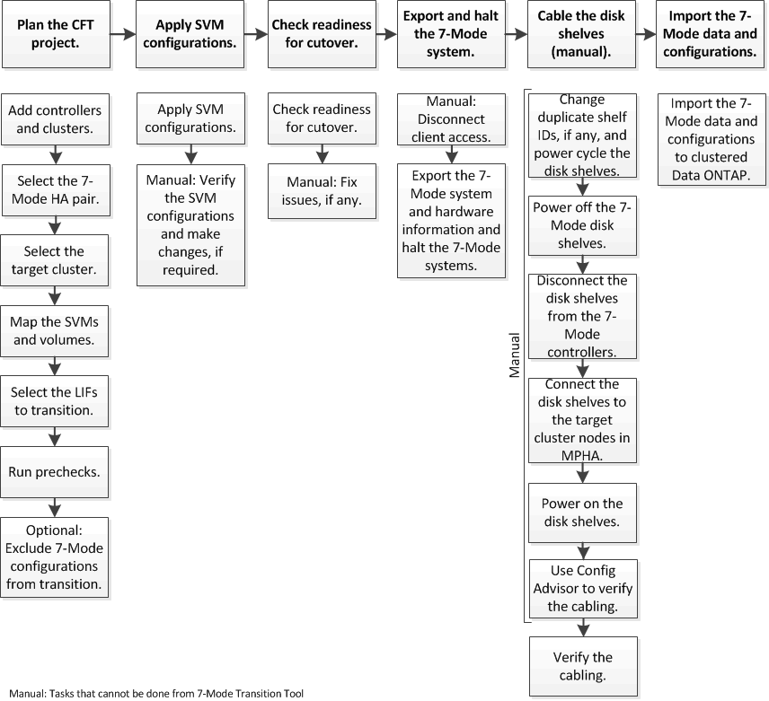

= Umstieg von 7-Mode Aggregaten mit einem Copy-Free Transition
:allow-uri-read: 
:icons: font
:imagesdir: ../media/

[role="lead"]
Der Workflow für die Copy-Free Transition umfasst die Planung eines Projekts, die Anwendung von 7-Mode Konfigurationen auf die SVMs, das Exportieren von 7-Mode Systeminformationen und das 7-Mode System, die manuelle Verkabelung der Festplatten-Shelfs zu Cluster-Nodes und den Import der 7-Mode Daten und Konfigurationen.

Sie müssen das 7-Mode System und das Cluster für einen Copy-Free Transition vorbereitet haben.

Die Storage-Umstellung kann maximal 4-8 Stunden betragen. Die Umstellungszeit umfasst die vom Tool benötigte Zeit zur Durchführung zweier automatisierter Vorgänge – des Export- und Einhalt- und Importbetriebs sowie die Zeit, die für die manuelle Verkabelung der Platten-Shelfs zu den neuen Controllern benötigt wird.

Der Export und der Import dauern ca. 2 Stunden oder weniger. Eine Verkabelung kann 2-6 Stunden oder weniger dauern.
