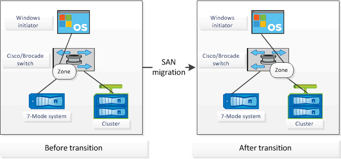

= Unterstützte Konfigurationen zur Erstellung eines FC-Zonenplans
:allow-uri-read: 
:icons: font
:imagesdir: ../media/

[role="lead"]
Um den FC-Zonenplan zu generieren, müssen Sie die unterstützten Konfigurationen von 7-Mode-Systemen, Hosts, FC Switches und Cluster kennen. Nach der Migration sollten Sie mithilfe des Plans Zonen für das Cluster konfigurieren.

Die 7-Mode Systeme (Single Controller oder ein HA-Paar), Hosts und Cluster können je nach Datacenter-Anforderungen entweder mit den Switches im selben Fabric oder mit unterschiedlichen Fabrics verbunden werden.

Die folgende Abbildung zeigt eine Konfiguration, in der 7-Mode Systeme, Hosts und Cluster mit den Switches im selben Fabric verbunden sind:

Die folgende Abbildung zeigt eine Konfiguration, in der 7-Mode Systeme und Cluster mit Switches in verschiedenen Fabrics verbunden sind:

image::../media/delete_me2_fc_zone_config2.gif[Die folgende Abbildung zeigt eine Konfiguration, in der 7-Mode Systeme und Cluster mit Switches in unterschiedlichen Fabric verbunden sind]
