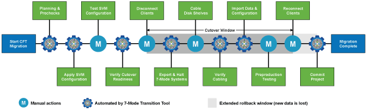

= Umstiegsphase zum 7-Mode Transition Tool
:allow-uri-read: 
:icons: font
:imagesdir: ../media/

[role="lead"]
Mit dem 7-Mode Transition Tool (7MTT) können Sie eine Copy-Free Transition (CFT) oder eine Copy-Based Transition (CBT) von Data ONTAP 7-Mode auf Clustered Data ONTAP durchführen. Sie müssen über die Phasen der einzelnen Migrationsmethoden verfügen und zudem wissen, wann die spezifischen Korrekturmaßnahmen für die Hosts durchgeführt werden müssen.

Die CFT-Phasen lauten wie folgt:

Die CBT-Phasen lauten wie folgt:

image::../media/delete_me_transition_operational_flow.gif[Copy-Based Transition Phases]
